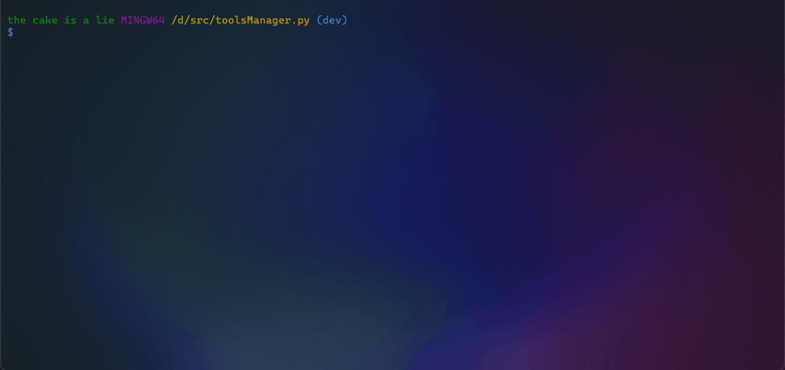

# **ToolsManager.py**

A multi-tool with a generic template for developing management tools like WSLBuilder for managing WSL instances built using images exported from Docker.

## Summary

- [**ToolsManager.py**](#toolsmanagerpy)
	- [Summary](#summary)
	- [I. Preview](#i-preview)
	- [II. Prerequisites](#ii-prerequisites)
		- [II.1 Dependencies](#ii1-dependencies)
	- [III. Uses](#iii-uses)
		- [III.1 Command Prompt](#iii1-command-prompt)
		- [III.2 Main Program](#iii2-main-program)
	- [IV. Tool Management](#iv-tool-management)
		- [IV.1 Tool Structure](#iv1-tool-structure)
		- [IV.2 Tools Registry](#iv2-tools-registry)
		- [IV.3 Tools Index](#iv3-tools-index)
	- [V. Options \& Configurations](#v-options--configurations)
	- [VI. Contributing](#vi-contributing)
	- [VII. License](#vii-license)

## I. Preview



[Summary](#summary)

## II. Prerequisites

> [!Important]
> Installing **[Python 3](https://www.python.org/downloads/)** is recommended to run this script on Windows.

[Summary](#summary)

### II.1 Dependencies

- [base64.b64decode](https://docs.python.org/3/library/base64.html#base64.b64decode), [base64.b64encode](https://docs.python.org/3/library/base64.html#base64.b64encode)
- [json.loads](https://docs.python.org/3/library/json.html#json.loads), [json.dumps](https://docs.python.org/3/library/json.html#json.dumps), [json.load](https://docs.python.org/3/library/json.html#json.load), [json.dump](https://docs.python.org/3/library/json.html#json.dump)
- [os.listdir](https://docs.python.org/3/library/os.html#os.listdir), [os.mkdir](https://docs.python.org/3/library/os.html#os.mkdir), [os.remove](https://docs.python.org/3/library/os.html#os.remove), [os.rmdir](https://docs.python.org/3/library/os.html#os.rmdir), [os.system](https://docs.python.org/3/library/os.html#os.system), [os.path](https://docs.python.org/3/library/os.path.html#os.path)
- [platform.system](https://docs.python.org/3/library/platform.html#platform.system)
- [re.split](https://docs.python.org/3/library/re.html#re.split)
- [random.shuffle](https://docs.python.org/3/library/random.html#random.shuffle)
- [readline](https://docs.python.org/3/library/readline.html)
- [shutil.rmtree](https://docs.python.org/3/library/shutil.html#shutil.rmtree)
- [sys.argv](https://docs.python.org/3/library/sys.html#sys.argv), [sys.version_info](https://docs.python.org/3/library/sys.html#sys.version_info)
- [time.sleep](https://docs.python.org/3/library/time.html#time.sleep)
- [traceback.format_exc](https://docs.python.org/3/library/traceback.html#traceback.format_exc)

> [!Note]
> [readline](https://docs.python.org/3/library/readline.html) is for multiline finder in linux system

[Summary](#summary)

## III. Uses

To use the tool manager, you need to open a terminal prompt and run the python script at the root of the project

> [!Important]
> Some tools present in the registry have dependencies contained in the [`libs/`](libs/) folder in the form of a `*.rar` file, you must unzip them by typing the command `$ python setup.py`

[Summary](#summary)

### III.1 Command Prompt

Usage: `$ python main.py <argument>`

| Arguments             | Values ​             ​| Descriptions                                |
| --------------------- | ------------------- | ------------------------------------------- |
| `-g`, `--generate`    | -                   | Generate a tool with interactive inputs     |
| `-l`, `--list`        | -                   | Display the list of Python tools            |
| `-s`, `--set`         | `<prop>`, `<value>` | Apply new configuration value to a property |
| `-t`, `--tool`        | `<tool>`            | Launch a tool                               |
| `-h`, `--help`        | -                   | Display the help menu                       |
| `-D`, `--debug`       | -                   | Run in debugger mode                        |
| `-v`, `--version`     | -                   | Display the program version                 |

[Summary](#summary)

### III.2 Main Program

Usage: `$ python main.py`

```
   _              _    __  __
  | |            | |  |  \/  |
  | |_ ___   ___ | | _|_\  / | __ _ _ __   __ _  __ _  ___ _ __
  | __/ _ \ / _ \| |/ _/|\/| |/ _` | '_ \ / _` |/ _` |/ _ \ '__|
  | || (_) | (_) | _\ \ |  | | (_| | | | | (_| | (_| |  __/ |
   \__\___/ \___/|/___/_|  |_|\__,_|_| |_|\__,_|\__, |\___|_|
     version: 0.1                               |___/

 List of commands:

 (mat)rix
 (sh)ell
 (wb)wslbuilder

 (s)ettings
 (v)ersion
 (h)elp

 (q)uit

(toolsManager.py)>
```

[Summary](#summary)

## IV. Tool Management

[Summary](#summary)

### IV.1 Tool Structure

Here you will find a typical example of a tool structure:

```python
#!/usr/bin/env python3
# -*- coding: utf-8 -*-

# tools/hello.py

# Importation of the tool model
from core.tool import Tool

class Hello(Tool):
	""" Say hello to the user
	"""

	command	= (("hello", "hel"), "(hel)lo") # The launch command control by name or alias
	name	= "Hello" # Tool name
	path	= __file__ # Path of tool file
	version	= "0.1a" # Tool version

	def __init__(self, args: list[str]):
		# Initialization of Tool
		super().__init__()

		# Argument registry corresponding to lamdba registry index
		self._args	= [
			(("-s", "--say-hello", ""), "Say a hello world")
		] + self._args[:]

		# Lamdba registry corresponding to argument registry index
		self._execs = [
			lambda x:self._sayHello(x)
		] + self._execs[:]

		# _run(args) method to lauch method in lambda registry with arguments
		# tips: you can rewrite the methode if you want to put some exception or rules to launch
		self._run(args)

	def _sayHello(self, args: list[str]) -> bool:
		print(f"Hello world :D")
		return(True)

	# ...
```

> [!Tip]
> Since the last update, you can create you own tool by typing `$ python main.py -g`

[Summary](#summary)

### IV.2 Tools Registry

[Summary](#summary)

### IV.3 Tools Index

| Tool                             | Version | Description                                |
| -------------------------------- | ------- | ------------------------------------------ |
| [Shell](docs/Shell.md)           | v1.0    | Prompt interface with custom schedules     |
| [Translator](docs/Translator.md) | v0.1a   | Translation tool manager                   |
| [WSLBuilder](docs/WSLBuilder.md) | v1.1    | Managing Docker images compatible with WSL |

[Summary](#summary)

## V. Options & Configurations

The program is configured from the **[config.json](config.json)** file in **json** format. In this file, you can set the **character encoding** and the splash screen display.

```json
{
  "colors": false,
  "encoding": "utf-8",
  "splash": true
}
```

You can modify it directly (which is not recommended) or use the configuration program with **all possible parameter choices in the "Settings" option in the main menu**.

> [!Note]
> You can manage settings with cli command `$ python main.py -s encoding utf-8` inside a shell
> 
> Or directly in main config index by typing `settings` & `set encoding utf-8` inside the program

[Summary](#summary)

## VI. Contributing

If you to contribute to the project, you access to the coding guideline at [CONTRIBUTING.md](CONTRIBUTING.md)

[Summary](#summary)

## VII. License

Code licensed under [GPL v3](LICENSE)

[Summary](#summary)
