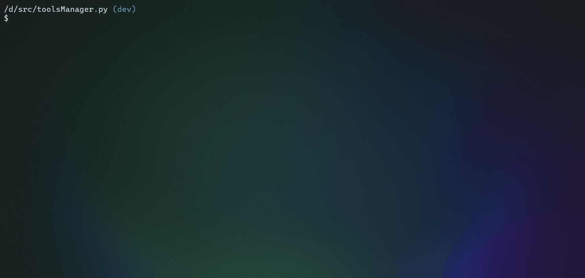

# **toolsManager.py**

Un multi-outils disposant de modèle générique permettant de développer des outils de gestion comme WSLBuilder pour la gestion des instances WSL construite à l'aide d'images exportés depuis Docker

## Sommaire

- [**toolsManager.py**](#toolsmanagerpy)
  - [Sommaire](#sommaire)
  - [Aperçu](#aperçu)
  - [Pré-requis](#pré-requis)
    - [Dépendances](#dépendances)
    - [WSL / Docker](#wsl--docker)
  - [Utilisations](#utilisations)
    - [Gestion des outils](#gestion-des-outils)
    - [Gestion WSL avec WSLBuilder](#gestion-wsl-avec-wslbuilder)
  - [Options \& Configurations](#options--configurations)
  - [Licence](#licence)

## Aperçu



[Sommaire](#sommaire)

## Pré-requis

L'installation de **[Python 3](https://www.python.org/downloads/)** est recommandé pour l'éxécution du script sur windows

[Sommaire](#sommaire)

### Dépendances

- [base64.b64decode](https://docs.python.org/3/library/base64.html#base64.b64decode), [base64.b64encode](https://docs.python.org/3/library/base64.html#base64.b64encode)
- [json.loads](https://docs.python.org/3/library/json.html#json.loads), [json.dumps](https://docs.python.org/3/library/json.html#json.dumps), [json.load](https://docs.python.org/3/library/json.html#json.load), [json.dump](https://docs.python.org/3/library/json.html#json.dump)
- [os.listdir](https://docs.python.org/3/library/os.html#os.listdir), [os.system](https://docs.python.org/3/library/os.html#os.system)
- [platform.system](https://docs.python.org/3/library/platform.html#platform.system)
- [random.shuffle](https://docs.python.org/3/library/random.html#random.shuffle)
- [sys.argv](https://docs.python.org/3/library/sys.html#sys.argv), [sys.version_info](https://docs.python.org/3/library/sys.html#sys.version_info)
- [time.sleep](https://docs.python.org/3/library/time.html#time.sleep)

[Sommaire](#sommaire)

### WSL / Docker

[Sommaire](#sommaire)

## Utilisations

Exécution du script: `$ python main.py <arg>`

| Arguments                    | Valeur                  | Descriptions                       |
| ---------------------------- | ----------------------- | ---------------------------------- |
| `-l`, `--list`               | -                       | Affiche la liste des outils python |
| `-t <tool>`, `--tool <tool>` | `<tool>` nom de l'outil | Lance un outil                     |
| `-h`, `--help`               | -                       | Affiche le menu d'aide             |
| `-D`, `--debug`              | -                       | Exécution en mode debuger          |
| `-v`, `--version`            | -                       | Affiche la version du programme    |

[Sommaire](#sommaire)

### Gestion des outils

[Sommaire](#sommaire)

### Gestion WSL avec WSLBuilder

[Sommaire](#sommaire)

## Options & Configurations

La configuration du programme se fait depuis le fichier **[config.json](config.json)** au format **json**, dans ce fichier vous pouvez l'**encodage des caractères** ainsi que l'affichage du splash screen.

```json
{
  "colors": false,
  "encoding": "utf-8",
  "splash": true
}
```

Vous pouvez le modifier directement (ce qui est peu conseiller) ou bien passer par le programme de configuration avec **tous les choix des paramètres possible à l'option "Paramètres" du menu principal**.

[Sommaire](#sommaire)

## Licence

Code sous license [GPL v3](LICENSE)

[Sommaire](#sommaire)
