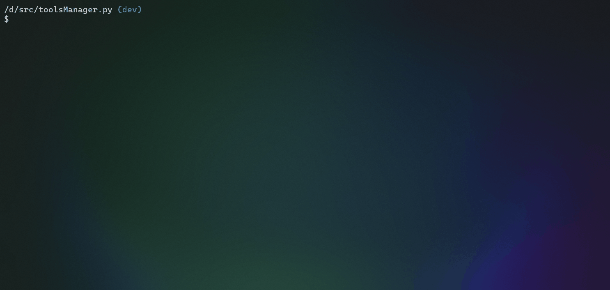

# **Shell**

[Back to index](../README.md)

## Summary

- [**Shell**](#shell)
  - [Summary](#summary)
  - [I. Preview](#i-preview)
  - [II. Command Prompt](#ii-command-prompt)

## I. Preview

[Summary](#summary)

## II. Command Prompt

Usage in shell: `$ python main.py -t shell <argument>`

Usage in script: `shell <argument>`

| Arguments                 | Values ​ ​   | Descriptions                         |
| ------------------------- | ------------ | ------------------------------------ |
| `-c`, `--command`         | `<cmd>`,     | Run a bash command                   |
| `-d`, `--delete-schedule` | `<sch>`, `*` | Delete a schedule of commands        |
| `-l`, `--list-schedule`   |              | List all schedules save in workspace |
| `-n`, `--new-schedule`    | `<sch>`,     | Create a schedule of commands        |
| `-r`, `--run-schedule`    | `<sch>`, `*` | Run a schedule of commands           |
| `-h`, `--help`            |              | Show the helper commands menu        |
| `-v`, `--version`         |              | Show version of tool                 |

> [!Tip]
> You can run a shell command without the `-c` argument like this: `shell ls -la`

[Summary](#summary)

[Back to index](../README.md)
